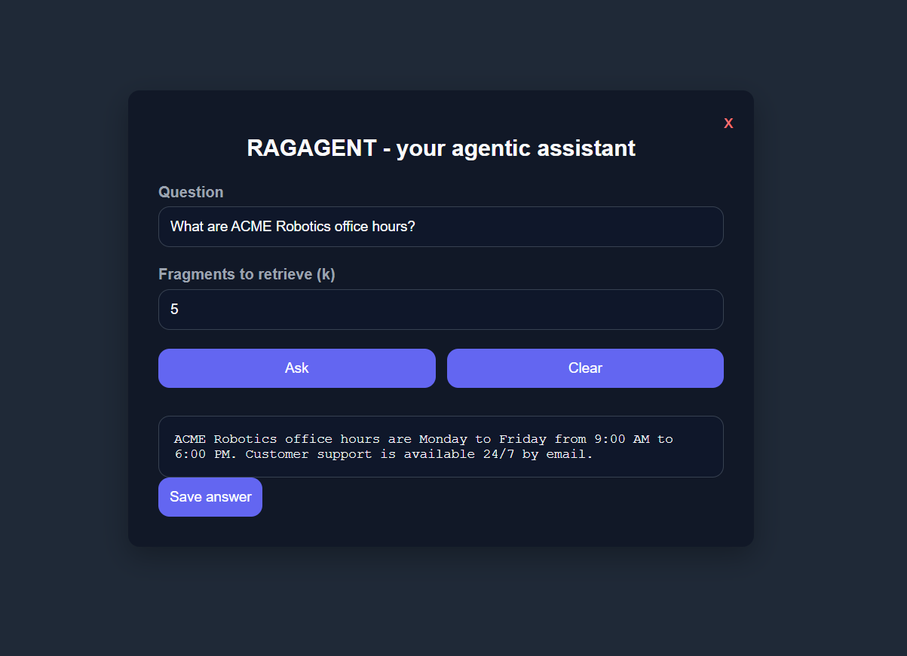
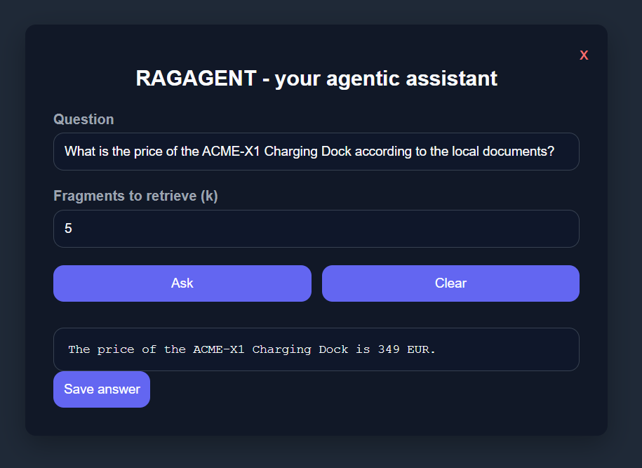
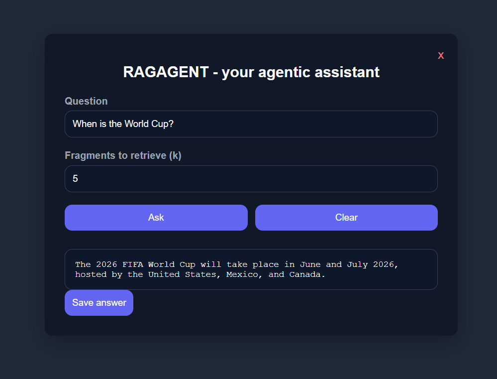

# RAGAGENT - Agentic RAG Assistant

[](https://www.python.org/)
[](LICENSE)
[](https://www.langchain.com/)
[](https://github.com/facebookresearch/faiss)

> A desktop **Retrieval-Augmented Generation (RAG)** agent that answers
> questions about a folder of company documents (PDF, DOCX, XLSX), falls back
> to a live web search when the answer is not local, and can send the result
> by email - all behind a small pywebview UI.

Originally built as the final project for the *Natural Language Processing*
course of the **Master in Data Analytics & AI (UFV, 2025)** for the company
**ADAMO**. The repository has since been generalised so it can be reused on
any document corpus.

---

## Screenshots

<table>
  <tr>
    <td align="center">
      <br/>
      <sub>Answering from the local documents</sub>
    </td>
    <td align="center">
      <br/>
      <sub>Another local-document answer</sub>
    </td>
    <td align="center">
      <br/>
      <sub>Web-search fallback in action</sub>
    </td>
  </tr>
</table>

---

## Demo questions

Once the app is running, try asking things like:

- *"What are ACME Robotics office hours?"* &mdash; answered from the local PDF.
- *"What is the price of the ACME-X1 Charging Dock?"* &mdash; answered from the XLSX.
- *"Who is the current Pope and when was he elected?"* &mdash; falls back to web search.
- *"Send an email to 'me@example.com' con el asunto 'Report' y con el mensaje 'Daily summary'."* &mdash; uses the email tool.

---

## How it works

```
                +---------------------------+
                |  Documents (PDF/DOCX/XLSX) |
                +-------------+--------------+
                              |
                              v
                  +-----------+-----------+
                  |  Text extraction +    |
                  |  cleaning + chunking  |
                  +-----------+-----------+
                              |
                              v
                  +-----------+-----------+
                  |  Sentence-Transformers|
                  |  embeddings (MiniLM)  |
                  +-----------+-----------+
                              |
                              v
                  +-----------+-----------+
                  |     FAISS index       |
                  +-----------+-----------+
                              |
                              v
+----------+    +-------------+-------------+    +------------------+
|  User    |--->|  LangChain ReAct agent    |<-->|  Bing web search |
| (UI)     |    |  (gpt-4o-mini)            |    +------------------+
+----------+    |                           |    +------------------+
                |                           |<-->|  Gmail SMTP tool |
                +---------------------------+    +------------------+
```

The agent picks **which tool to call** for each question:

| Tool | What it does |
| --- | --- |
| `search_documents` | Semantic search over the local FAISS index. |
| `search_web` | Lightweight Bing scrape for fresh public information. |
| `send_email` | Sends a plain-text email via Gmail SMTP. |

---

## Project layout

```
ragagent-adamo/
├── app.py                  # Main entry point - launches the desktop UI
├── index.html              # pywebview frontend (HTML + JS)
├── ragagent/               # Core package
│   ├── config.py           #  - Loads secrets and settings from .env
│   ├── documents.py        #  - PDF / DOCX / XLSX text extraction
│   ├── rag.py              #  - Chunking + embeddings + FAISS index
│   ├── tools.py            #  - LangChain tools (docs, web, email)
│   └── agent.py            #  - Agent factory
├── notebook/
│   └── RAGAGENT_demo.ipynb # Step-by-step walkthrough
├── DOCS/                   # Drop your documents here (samples included)
├── LOGS/                   # Saved Q&A sessions land here
├── .env.example            # Template for the required secrets
├── requirements.txt
└── LICENSE
```

---

## Quick start

### 1. Clone and install

```bash
git clone https://github.com/<your-username>/ragagent-adamo.git
cd ragagent-adamo

python -m venv .venv
# Windows
.venv\Scripts\activate
# macOS / Linux
source .venv/bin/activate

pip install -r requirements.txt
```

### 2. Configure your secrets

```bash
cp .env.example .env
```

Edit `.env` and set at minimum:

```
OPENAI_API_KEY=sk-...
```

To enable the email tool, also set:

```
GMAIL_USER=youraddress@gmail.com
GMAIL_APP_PASSWORD=your-16-char-app-password
```

> The Gmail field expects a [Google App Password](https://support.google.com/accounts/answer/185833),
> **not** your regular password.

### 3. Add your documents

Drop any `.pdf`, `.docx`, `.xlsx` or `.xls` file into `DOCS/`.
A few small fictional samples are included so the project works immediately.

### 4. Run

```bash
python app.py
```

A desktop window opens. Type a question, choose how many fragments to
retrieve (`k`), and the agent will route the request through the right tool.
Saved answers are written as JSON to `LOGS/`.

---

## Configuration reference

All settings live in `.env`. The defaults work for most use cases.

| Variable | Default | Purpose |
| --- | --- | --- |
| `OPENAI_API_KEY` | _required_ | Used by `langchain-openai` for the LLM. |
| `GMAIL_USER` | _optional_ | Sender address for the email tool. |
| `GMAIL_APP_PASSWORD` | _optional_ | Gmail app password (not your real one). |
| `EMBEDDING_MODEL` | `all-MiniLM-L6-v2` | Any Sentence-Transformers model id. |
| `LLM_MODEL` | `gpt-4o-mini` | Any chat model your key has access to. |
| `LLM_TEMPERATURE` | `0.2` | Lower = more deterministic. |
| `CHUNK_SIZE` | `500` | Chars per chunk. |
| `CHUNK_OVERLAP` | `50` | Char overlap between adjacent chunks. |
| `DEFAULT_K` | `5` | Fragments retrieved per question. |

---

## Tech stack

- **Python 3.10+**
- [LangChain](https://www.langchain.com/) - agent orchestration (ReAct)
- [OpenAI](https://platform.openai.com/) - `gpt-4o-mini` (configurable)
- [Sentence-Transformers](https://www.sbert.net/) - `all-MiniLM-L6-v2` embeddings
- [FAISS](https://github.com/facebookresearch/faiss) - vector similarity search
- [PyPDF2](https://pypi.org/project/PyPDF2/), [python-docx](https://pypi.org/project/python-docx/), [openpyxl](https://pypi.org/project/openpyxl/) - document parsing
- [BeautifulSoup4](https://www.crummy.com/software/BeautifulSoup/) + [requests](https://requests.readthedocs.io/) - Bing scraper
- [pywebview](https://pywebview.flowrl.com/) - lightweight desktop shell

---

## Limitations & next steps

- The FAISS index is rebuilt in memory on every launch; for larger corpora
  it should be persisted to disk and reloaded.
- The Bing scraper is best-effort and may break if Bing changes its markup.
  Swap it for a proper search API if you need reliability.
- The email tool currently only supports a Spanish-language instruction
  pattern (kept as-is for backward compatibility with the original project).
- No automated tests yet - this is a learning project.

---

## Authors

- Alejandro Magdiel
- Jorge Valdés
- Álvaro Gallego

UFV Master in Data Analytics & AI - NLP final project, 2025.

## License

[MIT](LICENSE)
